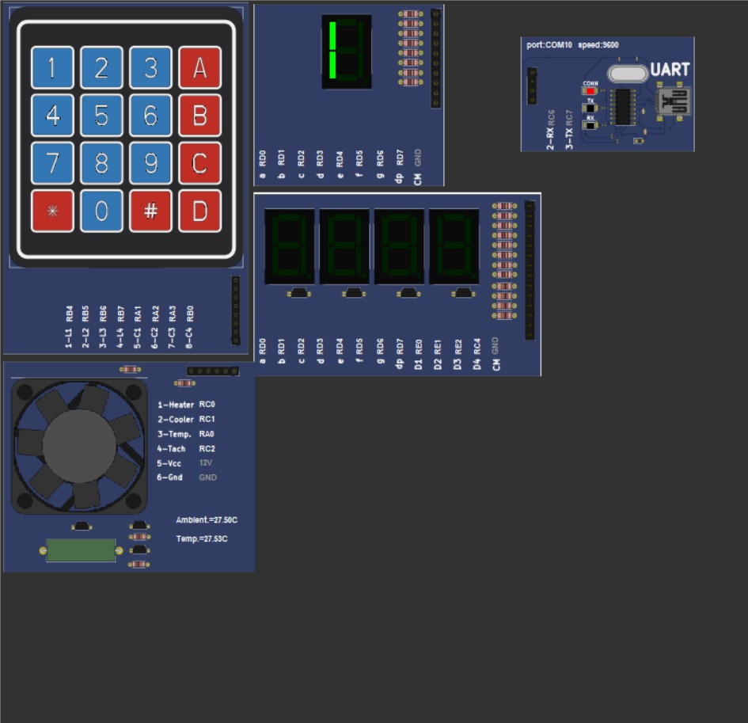
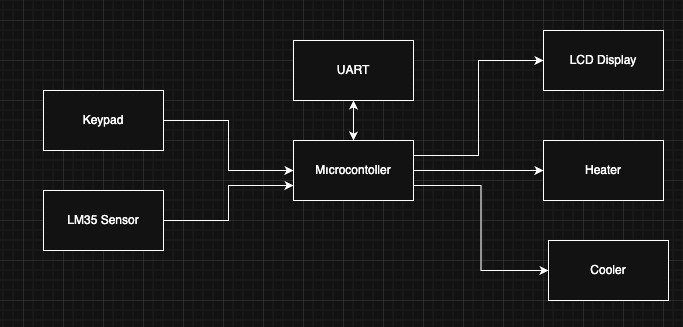
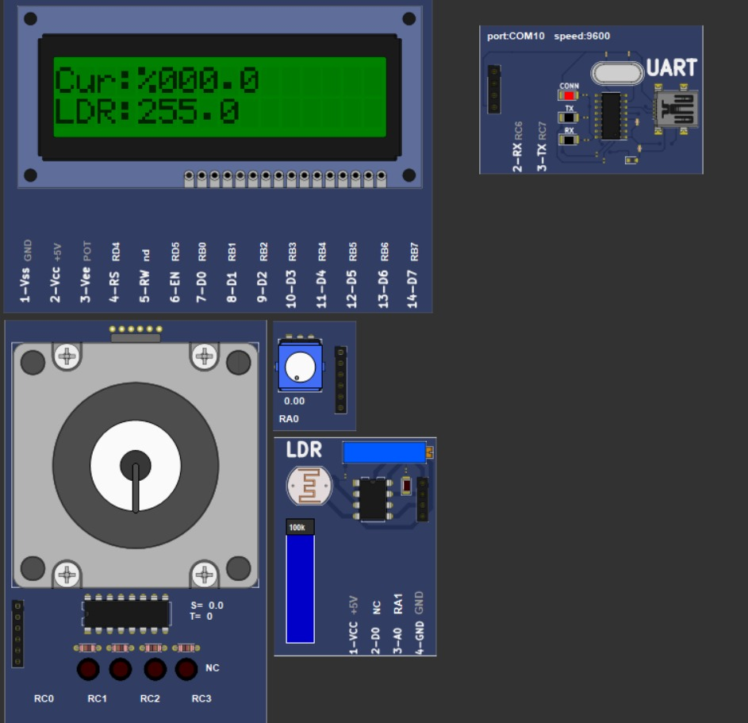
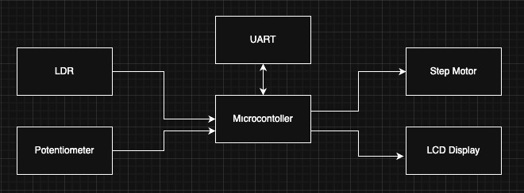
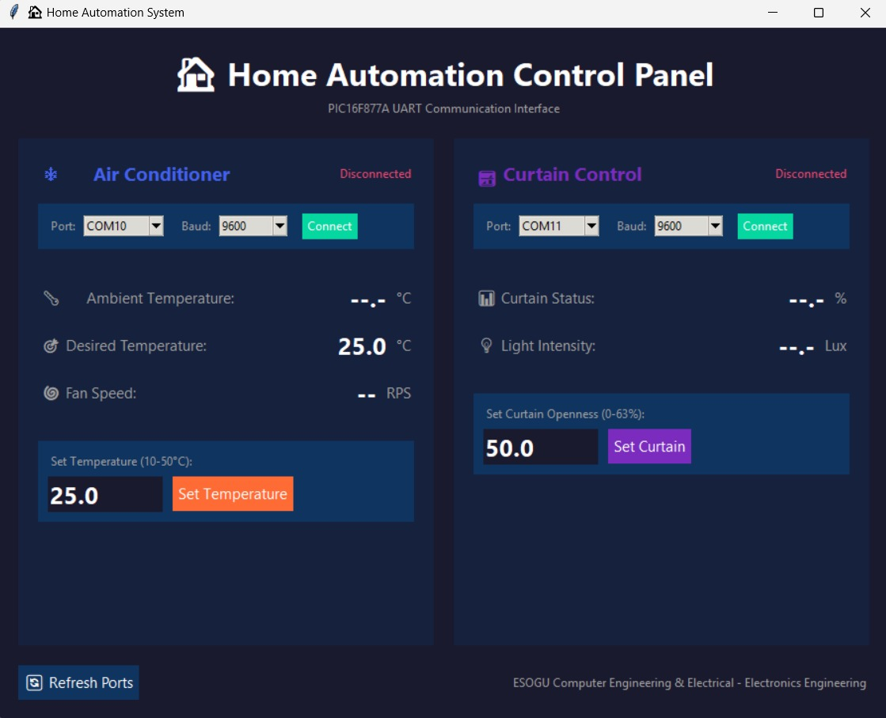

# PIC16F877A-Based Home Automation System

## Overview
This project is a **PIC16F877A-based Home Automation System** developed within the scope of the *Introduction to Microcomputers* course.  
The system simulates core smart-home functionalities by integrating **embedded hardware control**, **UART-based communication**, and a **PC-based graphical user interface**.

The architecture consists of **two independent microcontroller boards** and a **central PC application**, enabling real-time monitoring and control of environmental conditions.

---

## System Architecture
The overall system architecture and data flow between hardware and software components are illustrated below.  
The modular structure allows each subsystem to operate independently while remaining fully integrated via UART communication.

---

## Board #1 – Air Conditioner Control System
Board #1 is responsible for temperature measurement and air conditioning control operations.

### Main Functions
- LM35 temperature sensor (ADC-based measurement)
- Heater and cooling fan control using on–off logic
- 4×4 keypad for decimal temperature input
- 7-segment displays for user input and system status
- UART-based communication with the PC application

### Hardware Overview

### Functional Block Diagram

---

## Board #2 – Curtain Control System
Board #2 manages the curtain mechanism and environmental light-based automation.

### Main Functions
- Step motor control for precise curtain positioning
- LDR-based automatic control logic
- Potentiometer for manual curtain adjustment
- 16×2 LCD for real-time status display
- Priority Protection Mode for low-light conditions
- UART-based communication with the PC application

### Hardware Overview

### Functional Block Diagram

---

## PC Application
A PC-based graphical user interface was developed using **Python (Tkinter)** to provide centralized monitoring and control.

### Features
- Separate tabs for Air Conditioner and Curtain systems
- Real-time sensor and system status monitoring
- Parameter control via UART
- COM port selection and connection management
- Automatic data refresh

---

## Communication Protocol
Communication between the PC and the microcontrollers is implemented using **UART (9600 baud, 8N1)**.

### Protocol Characteristics
- Command–response architecture
- Single-byte data packets
- Integer and fractional parts transmitted separately
- Floating-point arithmetic avoided on the microcontroller

### Command Types
- **GET commands**: Read sensor and system data  
- **SET commands**: Write parameters using a **6-bit data mask**

Examples:
- `10xxxxxx` → fractional part  
- `11xxxxxx` → integer part  

This approach minimizes processing overhead while ensuring reliable data transmission.

---

## Simulation & Testing Environment
To eliminate hardware dependency and reduce development risk, the system was fully tested in a simulated environment.

### Tools Used
- **PICSimLab** – Hardware simulation
- **VSPE (Virtual Serial Port Emulator)** – Virtual COM port creation
- **RealTerm** – UART data monitoring and verification

All transmitted and received values were verified against on-screen displays, confirming correct protocol implementation.

---

## Key Features
- Modular dual-board system architecture
- Real-time PC-based control via UART
- Automatic and manual operating modes
- Priority protection mechanism for safety
- Decimal data handling without floating-point arithmetic
- Full simulation support without physical hardware

---

## Limitations
- UART SET commands limited to **6-bit data (0–63)**
- Wired communication only
- No data logging or persistent storage
- Assembly language increases maintenance complexity
- Validated only in simulation environment

---

## Technologies Used
- PIC16F877A
- Assembly Language
- Python (Tkinter)
- MPLAB X IDE
- PICSimLab
- VSPE
- RealTerm
- Git & GitHub

---

## Repository
🔗 https://github.com/berkaykyb/home_automation

---

## Authors
- **Berkay Kayabaşı** – Computer Engineering  
- Samet Toka – Computer Engineering  
- Süleyman Can Öztürk – Electrical & Electronics Engineering  
- Gizem Genç – Electrical & Electronics Engineering  
- Erkan Yavuz – Electrical & Electronics Engineering
